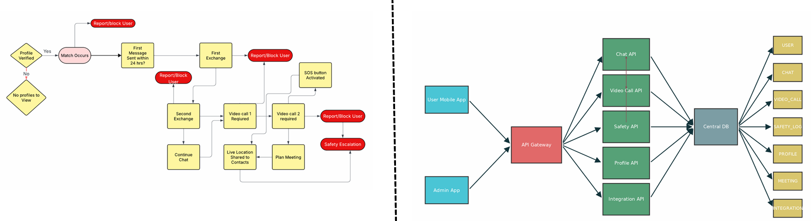
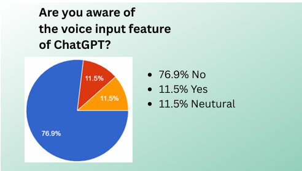

# Hi there, I'm Nikulansh Kapoor! 👋
### 🚀 Data-Driven Product Manager | Digital Strategy & Growth Specialist

**Professional Summary**
Data-driven Product Management aspirant with **3+ years of experience** in Digital Strategy and User Growth. Recently completed the **NextLeap Product Management Fellowship (2025)**, building a portfolio of high-impact case studies ranging from Feature Adoption to Trust & Safety Systems. I specialize in bridging the gap between **user psychology** and **technical implementation**, leveraging a strong background in market research and analytics.

---

### 🛠️ Core Product Skills

#### 🧠 Strategy & Frameworks
* **Prioritization:** RICE Framework (Reach, Impact, Confidence, Effort), MoSCoW Method.
* **Metrics:** North Star Metric Definition, Guardrail Metrics, KPI Tracking.
* **Lifecycle:** GTM Strategy, Product Lifecycle Management (PLM).

#### 💻 Technical Aptitude
* **System Design:** System Architecture Diagrams, Data Flow Mapping.
* **API Logic:** API Integration, Database Schema Concepts.
* **Tools:**    

#### 🔎 User Research
* **Methods:** User Persona Creation, Quantitative Surveys, Qualitative Interviews, Empathy Mapping.
* **Analytics:** Semrush, Excel/Google Sheets (Advanced).

---

### 📂 Product Management Projects (PRDs)

#### 🎓 [Graduation Project: "Bridge" Feature for Tinder](./Graduation_Project.pdf)
**Focus:** Trust & Safety | **Role:** Product Owner

* **Problem Identification:** Identified the critical **"Small-Talk Valley"** phenomenon where **71.9% of chats stall**, with **84.4% of users** citing safety concerns as the primary barrier to meeting offline.
* **Solution:** Conceptualized a "Mandatory Video Call & SOS" feature to validate user identity, creating a secure environment for the 18-24 age demographic.
* **Technical Implementation:** Engineered a **technical system diagram** detailing the interaction between User Mobile Apps, API Gateways, and Safety APIs to ensure real-time location sharing during emergencies.
* 
* **Strategic Prioritization:** Prioritized the MVP roadmap using the **RICE framework**, achieving a confidence score of 25 for the "Verified Profiles + SOS" solution over lower-impact alternatives.
***Success Metrics:** Defined **"Percentage of matches progressing to confirmed meetings"** as the North Star Metric and "Video Call Engagement Rate" as a leading indicator.

👉 **[📄 Read Full PRD & System Architecture](./Graduation_Project.pdf)**

#### 🚀 [Capstone Project: Voice Input Adoption for ChatGPT Mobile](./Milestone_3.pdf)
**Focus:** Growth & Feature Adoption | **Role:** Product Owner

* **Diagnosis:** Diagnosed a **76% feature unawareness rate** among the student demographic through rigorous market research and competitor analysis.
* 
* **The "fix":** Spearheaded the design of an "Onboarding Awareness" flow to disrupt UI blindness without compromising the app's minimalist aesthetic.
* **Impact Forecast:** Forecasted a **2x increase in adoption rate (7% → 15%)** by optimizing the discoverability funnel.
* **UX Design:** Constructed low-fidelity wireframes to visualize the user journey from feature discovery to first successful voice query.

👉 **[📄 Read Full Case Study](./Milestone_3.pdf)**

---

### 💼 Professional Experience

**Freelance Digital Marketing Strategist** | *DigiAcross Global / Independent*
*(Nov 2022 – Present)*

* **Growth Strategy:** Orchestrated comprehensive digital growth campaigns, utilizing data analytics to optimize **User Acquisition Costs (CAC)** and engagement.
* **Market Analysis:** Analyzed competitor landscapes to identify market gaps, positioning client products effectively against established players.
* **Stakeholder Management:** Managed cross-functional stakeholder expectations, translating complex business requirements into executable creative and marketing roadmaps.
* **Experimentation:** Designed high-conversion landing pages and creative assets, utilizing **A/B testing principles** to improve user retention and click-through rates.

---

### 📬 Connect with Me
* 📧 [k.nikulansh@gmail.com](mailto:k.nikulansh@gmail.com)
* 🔗 [LinkedIn Profile](https://www.linkedin.com/in/nikulanshkapoor/)
